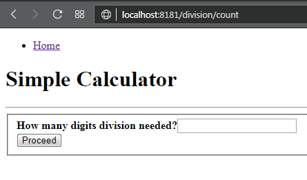
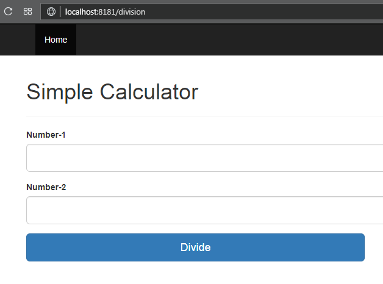
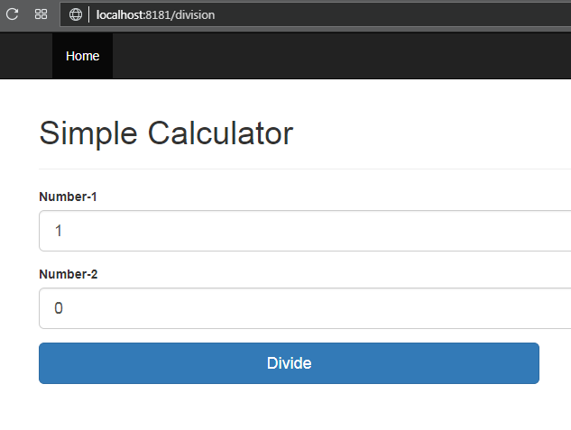
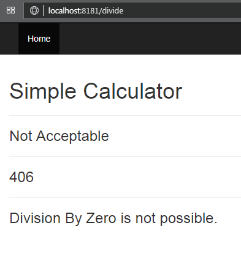
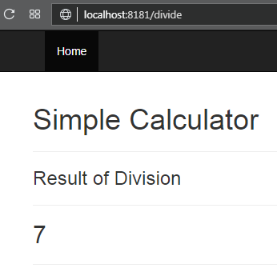

# simpleCal
Simple Calculator consists of 2 Services
1.  mathoperator-app : this is the UI component
2.  mathoperator-service : the core service which has the business logic

# Buildng the application
Download the code to local directory with ``git clone https://github.com/Sunilks879/simpleCal.git``. Import the project to an IDE (Intellij was used to create this application). 
Once the code has been imported execute the below command at root folder level
``mvn clean package -DskipTests``
-DskipTests is needed to skip the test written in ``mathopeator-app``
as that test cases are to test end-to-end (Smoke Test)

# Unit testing mathoperator-service
Execute this command ``mvn test -Dtest=CalculatorRestControllerTest -pl mathoperator-service`` for executing unit test for the 
``CalculatorRestController.java``. We have mocked the Service layer when we execute the unit test for Rest Controller

Execute this command ``mvn test -Dtest=MathOperatorTest -pl mathoperator-service`` for executing the unit test written for ``MathOperator.java``

# Testing from UI
Launch both the applications. 
```text
for launching mathoperator-app
java -jar mathoperator-app\target\mathoperator-app-0.0.1-SNAPSHOT.jar
```
```text
for launching mathoperator-service
java -jar mathoperator-service\target\mathoperator-service-0.0.1-SNAPSHOT.jar
```

UI will be accessible at  ``http://localhost:8181``

# Executing the Smoketest (End-to-End)
When ``mathoperator-app`` and ``mathoperator-service`` are running execute below command
```text
mvn test -Dtest=SmokeTest -pl mathoperator-app
```

# UI flow for Division
## Home Page

## Count
Value provided here will indicate how many numbers we need to consider to perform the operation

## Division
If the value selected is 2 in previous step then we will have 2 text box

## Exception
We cannot perform division by Zero. In case we provide we would have exception


## Success
If proper values are passed we will have success response




